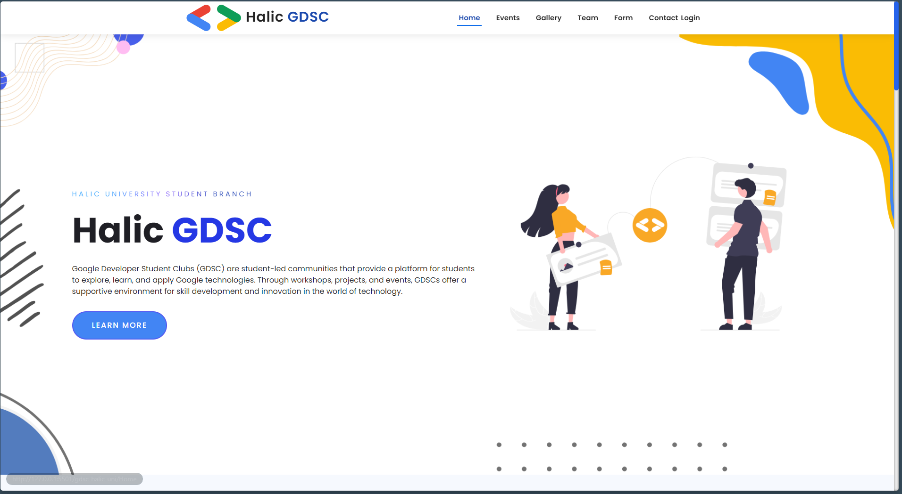

### Google Developer Student Club (DSC) Haliç University Website

<!-- TABLE OF CONTENTS -->

  
Table of Contents

  <ol>
    <li>
      <a href="#about-the-project">About The Project</a>
      <ul>
        <li><a href="#built-with">Built With</a></li>
      </ul>
    </li>
    <li>
      <a href="#getting-started">Getting Started</a>
      <ul>
        <li><a href="#prerequisites">Prerequisites</a></li>
        <li><a href="#installation">Installation</a></li>
      </ul>
    </li>
    <li><a href="#usage">Usage</a></li>
    <li><a href="#roadmap">Roadmap</a></li>
    <li><a href="#contributing">Contributing</a></li>
    <li><a href="#license">License</a></li>
    <li><a href="#contact">Contact</a></li>
    <li><a href="#acknowledgments">Acknowledgments</a></li>
  </ol>

This project is the official website for the Google Developer Student Club (DSC) at Haliç University. It serves as a platform where students can connect, engage with events, explore the team, and get involved in the club’s activities. The website is designed with a clean, modern user interface and incorporates custom CSS, animations, and interactive elements to provide a seamless experience.

## Features

- 🌟 Modern Interface: A sleek and user-friendly design with intuitive navigation.
- 📅 Event Listings: View and register for upcoming events seamlessly.
- 📸 Gallery: Explore event photos and moments from the club’s past activities.
- 👥 Team Section: Learn more about the DSC team members and their roles.
- 🎨 Custom CSS & Animations: A polished look with smooth transitions and branding consistency.
- 📱 Responsive Design: Optimized for all screen sizes, ensuring a great experience on mobile, tablet, and desktop devices.
- 🔐 Backend API: Manages user registration, stores contact form data, and keeps things secure.
- ⚡ Scalable: Built to easily adapt and expand as the club grows.

## Usage Examples

Here are a few examples of how users can interact with the Google DSC Haliç University website:

## 1. **Register for an Event**:

- Go to the [Events](#) page.
- Select an upcoming event.
- Fill in your details in the registration form and submit.
- You will receive a confirmation message once your registration is successful.

## 2. **Browse the Gallery**:

- Visit the [Gallery](#) page to see event photos.
- Scroll through the images or click on any photo to view it in full size.

## 3. **Contact the Team**:

- Head to the [Contact Us](#) section.
- Fill in the form with your name, email, and message.
- Submit the form, and the team will get back to you via email.

## 4. **Meet the Team**:

- Check out the [Team](#) page to learn more about the DSC members and their roles.
- Click on a team member's profile for more details.

For a more detailed overview of the site, you can [visit the live demo](https://kartal-dev.github.io/gdsc-halic-university/) or clone the repository to run it locally.

Be sure to:

## Roadmap

- [x] Advanced Visualization
- [x] Contact Page
- [x] Add notification system
- [x] Add version control for answer sheets.
- [ ] Multi-language Support
  - [ ] German
  - [ ] Turkish

## License

Distributed under the MIT License. See `LICENSE.txt` for more information.

## Contact

If you encounter any issues, feel free to open an issue or reach out to me [via email](kartal.dev).
